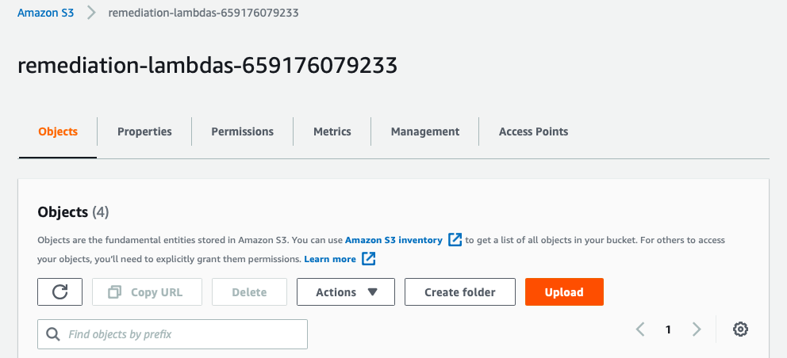

# Cloud Formation Templates
This repository contains all our cloud formation templates of our use cases and final product. This makes it easy to set up our application on any account and easy to tear down if needed. 

## What to do before deployment
There are a few things to customise before deployment.

1. If creating a new slack workplace, a workplace ID needs to be created by AWS to be inputted into the auto-critical-monitoring cloud formation template. This needs to be done before as this cannot be done automatically by the template. This can be done by AWS Chatbot > Configure New Client.
2. Ensure that all personal customisations are completed. These customisations are marked between double curly brackets on our lambda function files and cloud formation templates. All customisations are listed below.
  - INSERT_SLACK_CHANNEL_ID (enable-critical-monitoring.yaml)
  - INSERT_SLACK_WORKSPACE_ID  (enable-critical-monitoring.yaml)
  - INSERT_CHANNEL_NAME_HERE (for all index.py files)
  - INSERT_WEBHOOK_HERE (for all index.py files). If you're using Slack, your webhook should look something like "`https://hooks.slack.com/services/...`".
  - INSERT_ZIPFILE_NAME (for all remediation templates)

As part of our customisable solution, each remediation will need to be uploaded into the lambda-remediations S3 bucket. 

1. Run the solution.yaml cloud formation template. This will create your S3 buckets.
2. Zip each remediation you wish to implement and place them the lambda-remediation S3 bucket. See "How to upload files to an S3 Bucket" for a visual example of how to upload a file through the management console.
3. Make sure that you edit the accompanying cloud formation template to replace INSERT_ZIPFILE_NAME with the .zip file which contains the remediation. 

Finally, the application is ready to run. See "How to upload it to AWS Cloud Formation" for a visual example of how to use a cloud formation template through the management console.

1. Enable all resources from SOARdinator 3000 frontend
2. Navigate to Cloud Formation Stack to confirm that the corresponding stacks are created
3. Enjoy using our solution! (Note: In some cases, config rules can take up to 8 hours to load and work.)

A few things to double check in case of errors:
- Make sure that all the templates and lambda function files are deployed to the same AWS region. 
- Make sure that all the files are inside the correct S3 bucket and are referenced correctly inside the cloud formation template.

## How to upload files to an S3 Bucket
Click on your remediation bucket. It should be named “lambda-remediations-” followed by your account ID.

  

 

Click the Upload button.

  

 

Click on “Add Files” and add your .zip file/s. 

  

 

Click on the Upload button at the bottom of the screen.

  

 

Wait until upload is completed. This is shown by a green alert box at the top of the page. Once this is all done, your remediation has been successfully uploaded into the bucket.

  

 

## How to upload it to AWS Cloud Formation
Start by creating a new stack with new resources (standard).

  

 

Select the options "Template is ready" and "Upload a template file" as shown below. Import the AWS Cloud Formation template that you wish to implement.

  

 

Enter a name for your stack. Make sure that the name you enter is short and informative.

  

 

Since the template has already has everything configured for you, you can skip past the next step and go onto creating your stack. Make sure to tick off the box indicating that you wish to create IAM resources.

  

 

You should be redirected to a page that looks similar to this. 

  

 

Wait for your stack to be created. When the stack creation is complete, it should be indicated on the left with a green tick and the message "CREATE_COMPLETE".

  

 

## What to do next
The CloudFormation template has created all the necessary resources for you. Remediation should be automatic and require no further action.